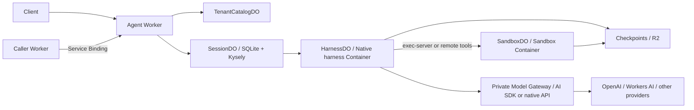

# CF-Open-Agents-API

An OSS Agents API built on Cloudflare Workers, SQLite Durable Objects, R2, and Containers.
Use `cf-open-agents-api` over HTTP with the OpenAI SDK or a typed Worker Service Binding.

**Alpha.** Targets the `agents=v1` contract in `openai@7.15.0`. See the
[compatibility profile](docs/compatibility.md) for supported fields and limitations.
This is an independent implementation; it is not an OpenAI or Cloudflare product.

**Preview dependency:** `@cloudflare/sandbox@0.13.0-next.751.1` requires its matching Docker image.
Preview upgrades can break APIs or restore behavior; validate all harnesses and backups.
See [deployment](docs/deployment.md) and [security](SECURITY.md).

## How it works



SessionDO owns the durable input log, turns, events, required actions, and execution
state. A Container is replaceable compute. Native harness state and workspace
checkpoints are committed together before a completed turn becomes visible.
Unknown execution outcomes fail explicitly instead of silently replaying side effects.
Effect provides typed runtime contracts, dependency layers, immutable execution
states and scoped concurrency. See the [Effect architecture and migration guide](docs/effect.md).

## Develop

Requires Node **24+** and **pnpm 11.1.2**. Docker is required for the Container example.
The native harness tests require **Codex 0.154.0** on `PATH`; the pinned Claude Code
and OpenCode runtimes are installed by pnpm.

```sh
pnpm install --frozen-lockfile
pnpm check
pnpm test:codex
pnpm test:harnesses
```

`pnpm test` runs the production API/session implementation inside workerd with real
SQLite and a scripted execution fixture. `pnpm test:codex` runs real Codex binaries
against a local scripted Responses server. `pnpm test:harnesses` connects all three native harnesses to the same AI SDK model,
including external tools and native history restoration. These tests use scripted inference.
`pnpm test:containers` additionally builds and runs the actual Worker and both
Containers, destroys the compute, and verifies R2 restore using a scripted model.

## Run the Worker example

```sh
pnpm build
cp examples/worker/.dev.vars.example examples/worker/.dev.vars
# Set API_TOKEN and OPENAI_API_KEY in that file.
pnpm dev
```

The example registers `coding`, `claude`, and `opencode` against one AI SDK model;
`workers` uses Workers AI. See [the composition root](examples/worker/src/index.ts).
Local sandbox backups use Wrangler's emulated R2 binding.
All three harnesses support `none` or an assigned Sandbox. Workers AI calls use your
Cloudflare account, including during local development. The portable model gateway
carries text and function calls; see [model limitations](docs/extending.md#model-protocols)
for reasoning, provider extensions, and Claude Code support boundaries.
See [deployment](docs/deployment.md) for production R2 credentials and sizing.

```ts
import OpenAI from "openai";

const client = new OpenAI({
  baseURL: "http://localhost:8787/v1",
  apiKey: process.env.AGENT_API_TOKEN,
});
const session = await client.beta.agents.sessions.create({
  agent: { model: "coding" },
  environment: { type: "openai_hosted" },
  input: "Create a small TypeScript project in /workspace.",
});
console.log(session.id);
```

`openai_hosted` is the compatibility protocol's spelling for managed compute;
**this deployment provisions Cloudflare Containers**. `none` disables the execution
environment. Unsupported environment provisioning fields are rejected.

Poll until `idle`, `requires_action`, or `failed`, then inspect items and turns.
For one streamed turn, use `client.beta.agents.sessions.stream(session.id, { input: "Hello" })`
on an idle session. It subscribes before submitting input and can run tool handlers.
Disconnecting does not cancel execution.

## Service Binding

Bind the caller's `AGENTS` service to the deployed Worker. The caller authenticates
its users and supplies tenant IDs; Service Bindings are a trusted boundary.

```ts
const session = await env.AGENTS.createSession("tenant-123", {
  agent: { model: "coding" },
  environment: { type: "none" },
}, "creation-key");
await env.AGENTS.submitEvents("tenant-123", session.id, [{
  type: "agent.session.input.message",
  input: [{ role: "user", content: [{ type: "input_text", text: "Hello" }] }],
}], "message-key");
```

## Extend

- [Harnesses and models](docs/extending.md): Codex, Claude Code, OpenCode, AI SDK models, Workers AI,
  and the driver contract for additional harnesses.
- [Tools and assets](docs/extending.md#tools-and-assets): typed tools, web/corpus search,
  and immutable skill bundles.
- [Architecture](docs/architecture.md): current service boundaries, persistence and recovery.
- [Contributing](CONTRIBUTING.md): code layout, validation, and compatibility changes.
- [Development agent guidance](docs/development-harness.md): selected Skills, task briefs,
  instruction ownership and checks.

## Commands

| Command | Purpose |
| --- | --- |
| `pnpm check` | Documentation/agent harness checks, typecheck, lint, tests and builds |
| `pnpm check:docs` | Verify project names, entrypoints, commands, bindings and image pins |
| `pnpm check:harness` | Check documentation links, agent entrypoints, skills and licenses |
| `pnpm test:scripts` | Checker failure fixtures |
| `pnpm test:package` | Packed library installation and consumer type checks |
| `pnpm typecheck` | Check TypeScript without emitting files |
| `pnpm lint` | Check formatting and lint rules |
| `pnpm test` | Worker, SQLite, streaming and asset tests |
| `pnpm test:codex` | Native Codex protocol and checkpoint tests |
| `pnpm test:harnesses` | Native Codex/Claude Code/OpenCode, model gateway, tools and checkpoint tests |
| `pnpm test:containers` | All three harnesses: separate Sandbox execution, skills and R2 restore |
| `pnpm build` | ESM JavaScript and declaration files |
| `pnpm dev` | Local Worker and Containers |
| `pnpm types` | Regenerate example binding/runtime types |
| `pnpm deploy:check` | Build images and run Wrangler's deployment dry run |
| `pnpm format` | Format code and organize imports |

## License

Apache-2.0; bundled development skills retain the licenses listed in [NOTICE](NOTICE).
See [CHANGELOG.md](CHANGELOG.md), [contributing](CONTRIBUTING.md) and [release instructions](docs/releasing.md).
