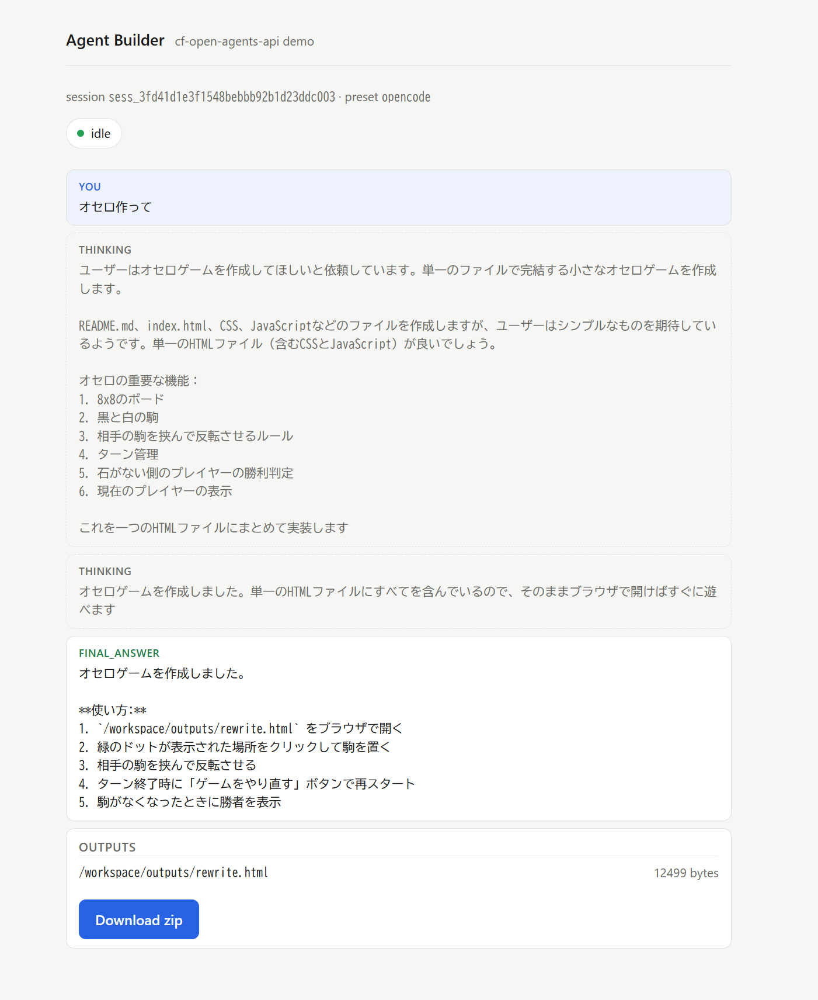
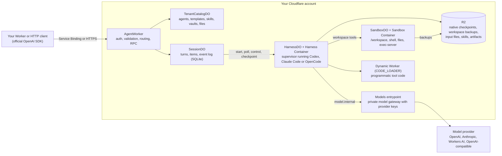

# CF-Open-Agents-API

[](https://www.npmjs.com/package/cf-open-agents-api)
[](LICENSE)
[](package.json)
[](https://workers.cloudflare.com/)

**An unofficial, open-source implementation of the OpenAI Agents API (`agents=v1`) that runs Codex, Claude Code or OpenCode on your own Cloudflare account, against models you configure.**

Keep the official OpenAI SDK on the client and point it at your Worker. The Worker owns the API, the session state, the sandboxes and the model credentials.

## Key features

- **Works with the official SDK.** Sessions, turns, items, streaming, environments, files, skills, artifacts, subagents, MCP and vaults from `openai@7.15.0`; the [compatibility profile](docs/compatibility.md) lists what differs.
- **Native runtimes in containers.** Codex `0.154.0`, the Claude Agent SDK `0.3.268` and OpenCode `1.18.30` run in Cloudflare Containers with an isolated `/workspace`. Each runtime keeps its own agent loop; this project supplies the sandboxes, tools, durability and the API around it.
- **Credentials stay in the Worker.** The harness container has no Internet access. Model traffic leaves only through a private gateway that holds the provider keys; neither runtime nor sandbox ever sees them.
- **Durable by design.** Every transition is one SQLite transaction in a Durable Object; checkpoints and workspace backups live in R2. A dropped connection never loses a turn, and the next turn resumes from the last committed checkpoint.
- **Hosted environments and tools.** Shell and file tools in the sandbox, hosted web search, MCP servers with Vault credentials, programmatic tool calling in an isolated Dynamic Worker, and delegation between runtimes.

## Quick start

The setup CLI creates a Worker with the API and a small demo app: a prompt form, a job page that streams the turn as it runs, and a download of the files the agent wrote. You need Node 24, pnpm and a running Docker engine. The `workers` preset runs against Workers AI and needs no provider key.

```sh
mkdir my-agents && cd my-agents
pnpm dlx create-cf-open-agents-api@alpha init     # choose the demo template and a provider
pnpm install
pnpm exec wrangler login
pnpm dev                                            # or pnpm dev:rootless when init offered it
```

Open <http://localhost:8787>, type a prompt, pick a preset and press **Build**. The [QuickStart](docs/quickstart.md) explains what happens under the hood and answers the first questions that come up.



To add the API to a Worker you already have (a Vite app, a Hono Worker, anything Wrangler deploys), run `init` in its directory instead. It writes the bindings into `wrangler.jsonc` without losing your comments, generates the composition in `src/agents.ts` and snapshots the Docker build context into `.cf-open-agents-api/`. The [CLI README](packages/create-cf-open-agents-api/README.md) covers `init`, `setup` and `doctor`.

## Use it from your Worker

Bind the Agent Worker as a service named `AGENTS` and give the official client `tenantFetch` as its `fetch`. The binding is the credential: the trusted Worker names the tenant, and no bearer token crosses it.

```ts
import { tenantFetch } from "cf-open-agents-api/cloudflare";
import OpenAI from "openai";

const client = new OpenAI({
  apiKey: "service-binding", // the SDK requires a value; the API never reads it on this path
  baseURL: "https://agents.internal/v1",
  fetch: tenantFetch(env.AGENTS, "default"),
});

const session = await client.beta.agents.sessions.create(
  { agent: { model: "codex" }, environment: { type: "openai_hosted" } },
  { headers: { "Idempotency-Key": "session-1" } },
);
for await (const event of client.beta.agents.sessions.stream(session.id, {
  input: "Write a short report to /workspace/outputs/report.md and summarize it.",
  idempotencyKey: "turn-1",
})) {
  if (event.type === "agent.session.turn.output_text.delta") process.stdout.write(event.delta);
  if (event.type === "agent.session.turn.failed" && !event.turn.subagent_id)
    throw new Error(event.turn.error?.message ?? "turn failed");
}
```

`agents.internal` is a routing label; the request never leaves the Service Binding. `openai_hosted` is the SDK's wire name and selects a Cloudflare sandbox here. `codex` is a preset the deployment defines; clients never see provider URLs or keys.

Calling over HTTPS from Node, Python or anywhere else? Set `baseURL` to your Worker's URL and pass the bearer token as `apiKey`; see the [HTTP guide](docs/http-api.md). A trusted Worker can also skip HTTP and call the [typed RPC methods](docs/rpc.md).

## Architecture



One Worker exports every class. Each session has its own SessionDO, HarnessDO and SandboxDO. A turn is submitted in one transaction, driven by a Durable Object alarm, streamed from the durable event log, and sealed by a checkpoint to R2. [Architecture](docs/architecture.md) walks through a turn end to end and states the durability rules.

## Configure the Worker

`defineAgentWorker` composes everything from three things you own: the presets clients can name, the private model gateway, and how a request maps to a tenant.

```ts
import { createOpenAI } from "@ai-sdk/openai";
import {
  type AgentBindings,
  bearerTenant,
  type ContainerBindings,
  defineAgentWorker,
} from "cf-open-agents-api/cloudflare";
import { aiSDKModel, nativeModel } from "cf-open-agents-api/models";

interface Bindings extends AgentBindings, ContainerBindings {
  API_TOKEN: string;
  OPENAI_API_KEY: string;
}

export const { Agents, Models, SessionDO, TenantCatalogDO, HarnessDO, SandboxDO, ContainerProxy } =
  defineAgentWorker<Bindings>({
    // Presets: what clients name in agent.model. They never see the connection behind it.
    agents: {
      codex: { harness: "codex", model: "codex", webSearch: true, delegates: ["claude"] },
      claude: { harness: "claude-code", model: "primary", tiers: { haiku: "fast" } },
    },
    // The private gateway: deployment-owned names mapped to provider connections.
    models: (env) => ({
      codex: () =>
        nativeModel({
          protocol: "responses",
          baseURL: "https://api.openai.com/v1",
          apiKey: env.OPENAI_API_KEY,
          model: "gpt-6-astra",
        }),
      primary: () => aiSDKModel(createOpenAI({ apiKey: env.OPENAI_API_KEY })("gpt-6-astra")),
      fast: () => aiSDKModel(createOpenAI({ apiKey: env.OPENAI_API_KEY })("gpt-5.6-luna")),
    }),
    // Who is calling: the HTTP path maps a bearer token to a tenant.
    authenticate: (request, env) => bearerTenant(request, env.API_TOKEN, "default"),
  });

export default Agents;
```

`nativeModel` passes a provider's own protocol through unchanged, so reasoning state, images and hosted tools survive; `aiSDKModel` and `openAICompatibleModel` translate any AI SDK or Chat Completions model, including Workers AI. The [library API](docs/library-api.md) documents every option, [Extending](docs/extending.md) covers custom drivers and adapters, and [Web search](docs/web-search.md) shows hosted search next to a search of your own.

## Limitations

This is pre-release software published under the npm `alpha` dist-tag; expect breaking changes until `1.0`. It implements the `agents=v1` surface as the [compatibility profile](docs/compatibility.md) describes it, not every field of every endpoint, and it does not reproduce OpenAI's hosted infrastructure, billing or policies. The portable model adapters carry text, images, function calls, reasoning effort and structured output, but not encrypted reasoning or hosted tools; OpenCode has no hosted web search at all. Wrangler's local containers assume a rootful Docker bridge, so a rootless engine needs the workaround the CLI offers as `dev:rootless` ([known issues](docs/known-issues.md)).

It is also more than some jobs need. If a single model call with tools is enough, a Worker calling a provider directly is simpler. If you need OpenAI's hosted environments exactly as OpenAI runs them, use OpenAI. What this project buys you is the Agents API programming model with your own runtime, your own model provider, and session state, workspaces and provider keys that never leave your Cloudflare account.

## Requirements and costs

| Requirement        | Detail                                                                                                                            |
| ------------------ | --------------------------------------------------------------------------------------------------------------------------------- |
| Node and pnpm      | Node 24 or newer; pnpm `11.1.2`, the pinned `packageManager`                                                                      |
| Docker             | A running engine for local development. The two images need roughly 5 GB; the first build takes several minutes                   |
| Cloudflare account | Workers Paid plan (Containers require it), Durable Objects with SQLite, R2, and Workers AI for the `workers` preset               |
| Model credentials  | An OpenAI or Anthropic key for the `codex`, `claude` and `opencode` presets; nothing beyond your Cloudflare account for `workers` |

In production you pay for container run time (a harness container on the `basic` instance type and a sandbox on `standard-1`, both idle-stopped after 10 minutes), R2 storage for checkpoints and backups (backups expire after 30 days), Durable Object requests and storage, and whatever your model provider bills. A session keeps its sandbox between turns, so a chatty session pays for one container pair, not one per turn. Nothing here sets a spending limit for you; [Deployment](docs/deployment.md) has the cost model and the scaling knobs.

## Develop

```sh
git clone https://github.com/inaridiy/CF-Open-Agents-API.git && cd CF-Open-Agents-API
pnpm install --frozen-lockfile
pnpm check            # docs, harness, types, lint, build, scripts, CLI and Worker tests
```

`packages/agent-api` is the library, `packages/supervisor` the Node process that drives the native runtimes inside the harness container, `packages/create-cf-open-agents-api` the setup CLI, and `examples/` holds the deployable Worker, the demo app and a consuming Worker. The scripted suites need no provider credentials. [CONTRIBUTING](CONTRIBUTING.md) has the first local run, every command, and which checks a change needs.

## Documentation

| Topic                                        | Guide                                                                     |
| -------------------------------------------- | ------------------------------------------------------------------------- |
| The demo, step by step                       | [QuickStart](docs/quickstart.md)                                          |
| Another Worker over a Service Binding        | [Service Binding](docs/service-binding.md)                                |
| Typed RPC without HTTP                       | [RPC](docs/rpc.md)                                                        |
| Node, Python or anything else over HTTPS     | [HTTP API](docs/http-api.md)                                              |
| The setup CLI and the generated files        | [create-cf-open-agents-api](packages/create-cf-open-agents-api/README.md) |
| Embedding the library in your own Worker     | [Library API](docs/library-api.md)                                        |
| Files, skills, MCP, subagents, forks         | [Environments and tools](docs/environments-and-tools.md)                  |
| Hosted web search, or a search of your own   | [Web search](docs/web-search.md)                                          |
| Presets, model adapters, custom drivers      | [Extending](docs/extending.md)                                            |
| Durability rules and service boundaries      | [Architecture](docs/architecture.md)                                      |
| Production setup, costs and scaling          | [Deployment](docs/deployment.md)                                          |
| What the official SDK can and cannot do here | [Compatibility profile](docs/compatibility.md)                            |

## Compatibility and disclaimer

- Implements the `agents=v1` surface of `openai@7.15.0`; runs Codex `0.154.0`, the Claude Agent SDK `0.3.268` and OpenCode `1.18.30`.
- Not affiliated with, endorsed by or supported by OpenAI, Anthropic, the OpenCode project or Cloudflare. "OpenAI", "Codex", "Claude", "Claude Code", "OpenCode" and "Cloudflare" are trademarks of their owners and are used here only to describe compatibility.
- Does not use Cloudflare's `agents` npm package. The name describes the API it implements, not a dependency.

## Contributing and license

Contributions are welcome. [CONTRIBUTING](CONTRIBUTING.md) explains the toolchain, the validation matrix and the scope of a good change; [SECURITY](SECURITY.md) is for vulnerability reports and [CHANGELOG](CHANGELOG.md) tracks releases.

Apache-2.0, see [LICENSE](LICENSE). Vendored development skills keep their upstream licenses; see [NOTICE](NOTICE).
