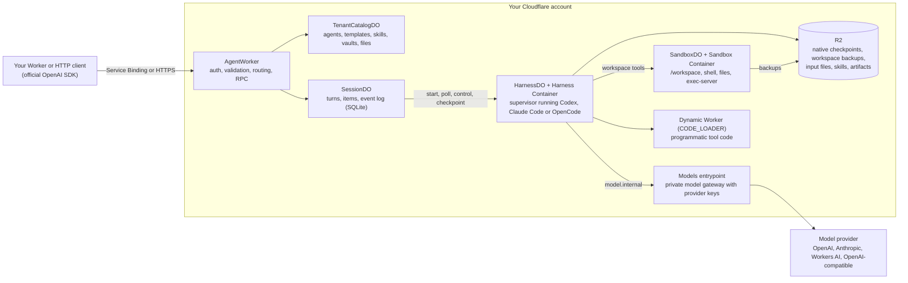

# CF-Open-Agents-API

**An unofficial, independent implementation of the OpenAI Agents API that runs Codex, Claude Code or OpenCode on your own Cloudflare account, against models you configure.**

Keep the official OpenAI client. Point it at your Worker. The Worker owns the API, the session state, the sandboxes and the model credentials.

## What it is and is not

- It implements the `agents=v1` surface of `openai@7.15.0`: agents, sessions, turns, items, streaming, environments, files, skills, artifacts, subagents, MCP and vaults. The [compatibility profile](docs/compatibility.md) lists what is implemented, what differs and what is missing.
- It runs the native agent runtimes (Codex `0.154.0`, Claude Agent SDK `0.3.268`, OpenCode `1.18.30`) in Cloudflare Containers. Each runtime keeps its own agent loop; this project supplies sandboxes, tools, durability and the API around it.
- It is not affiliated with, endorsed by or supported by OpenAI, Anthropic, the OpenCode project or Cloudflare. "OpenAI", "Codex", "Claude", "Claude Code", "OpenCode" and "Cloudflare" are trademarks of their owners and are used here only to describe compatibility.
- It does not use Cloudflare's `agents` npm package. The name describes the API it implements, not a dependency.
- It is pre-release software. Version `0.2.0` is unreleased; nothing has been published to npm yet. Expect breaking changes until `1.0`.

## Who it is for

- Teams that want the Agents API programming model (sessions, turns, hosted environments, tool results) with their own choice of runtime and model provider.
- Teams that need session state, workspaces and provider keys to stay inside one Cloudflare account.
- Contributors interested in durable agent execution on Durable Objects, Containers and R2.

If you only need a single model call with tools, this project is more than you need. If you need OpenAI's hosted environments exactly as OpenAI runs them, use OpenAI.

## Architecture



One Worker exports every class. Each session has its own SessionDO, HarnessDO and SandboxDO. The harness container never has Internet access; model traffic leaves only through the private gateway, which holds the provider credentials. See [architecture](docs/architecture.md) for the durability rules.

## Prerequisites and costs

| Need                    | Detail                                                                                                                                                                                                                          |
| ----------------------- | ------------------------------------------------------------------------------------------------------------------------------------------------------------------------------------------------------------------------------- |
| Node                    | 24 or newer. CI uses `24.15.0`.                                                                                                                                                                                                 |
| pnpm                    | `11.1.2`, the pinned `packageManager`.                                                                                                                                                                                          |
| Docker                  | A running engine for `pnpm dev`, `pnpm dev:caller`, `pnpm test:containers` and `pnpm deploy:check`. The two images in `docker/` need roughly 5 GB; the first build installs Node, Codex and OpenCode and takes several minutes. |
| Cloudflare account      | Workers Paid plan (Containers require it), Durable Objects with SQLite, R2, and Workers AI if you use the `workers` preset.                                                                                                     |
| Model credentials       | An OpenAI API key for the `coding`, `claude` and `opencode` presets, or nothing beyond your Cloudflare account for the `workers` preset (Workers AI).                                                                           |
| Codex `0.154.0` on PATH | Only for `pnpm test:codex` and `pnpm test:harnesses`. pnpm installs the pinned Claude Agent SDK and OpenCode.                                                                                                                   |
| `python3`               | Only for `pnpm test:containers`; the smoke builds a plugin archive with it.                                                                                                                                                     |

What you pay for in production: Container run time (a harness container on the `basic` instance type and a sandbox container on `standard-1`, both idle-stopped after 10 minutes), R2 storage for checkpoints and workspace backups (backups expire after 30 days), Durable Object requests and storage, and whatever your model provider bills. The example keeps a session's sandbox alive between turns, so a chatty session pays for one container pair, not one per turn. Nothing in this repository sets a spending limit for you; see [deployment](docs/deployment.md) for the cost model and scaling knobs.

## First run without a paid model key

The `workers` preset runs Codex against Workers AI. Workers AI has no local emulator: `wrangler dev` sends `AI` binding calls to your account, so you must be logged in (`wrangler login`) and the calls count against your Workers AI usage.

```sh
git clone https://github.com/inaridiy/CF-Open-Agents-API.git
cd CF-Open-Agents-API
pnpm install --frozen-lockfile
pnpm build
cp examples/worker/.dev.vars.example examples/worker/.dev.vars
cp examples/caller/.dev.vars.example examples/caller/.dev.vars
# Put the same unpredictable API_TOKEN (at least 32 characters) in both files.
# Leave OPENAI_API_KEY empty if you have no OpenAI key: presets are built only
# when a session selects them, and the `workers` preset never calls OpenAI.
pnpm dev:caller
```

Wrangler builds both Docker images, starts the Agent Worker and starts the caller on `http://localhost:8788`. Then:

```sh
export AGENT_API_TOKEN=... # the API_TOKEN from .dev.vars
curl http://localhost:8788/sdk/sessions \
  -H "Authorization: Bearer $AGENT_API_TOKEN" \
  -H 'Content-Type: application/json' -H 'Idempotency-Key: first-report' \
  -d '{"agent":{"model":"workers"},"environment":{"type":"openai_hosted"},"input":"Write /workspace/outputs/report.txt with a short greeting, then read it back and report the result."}'
```

Poll `GET /sdk/sessions/<id>` with the same header until `session.status` is `idle`, `requires_action` or `failed`. The response includes the items and turns. `DELETE /sdk/sessions/<id>` removes the session. The [caller source](examples/caller/src/index.ts) implements this journey through both the SDK (`/sdk`) and typed RPC (`/rpc`).

Use `"model":"coding"` with a real `OPENAI_API_KEY` for the full Codex experience (native Responses, images, hosted web search, structured output). Use `claude` or `opencode` to run the other runtimes against the same key through the portable AI SDK adapter.

## Use it from your Worker

Bind the Agent Worker as a service named `AGENTS`, then hand its `fetch` to the official client:

```ts
import OpenAI from "openai";

const client = new OpenAI({
  baseURL: "https://agents.internal/v1",
  apiKey: env.API_TOKEN,
  fetch: (input, init) => env.AGENTS.fetch(new Request(input, init)),
});
const session = await client.beta.agents.sessions.create(
  { agent: { model: "coding" }, environment: { type: "openai_hosted" } },
  { headers: { "Idempotency-Key": "report-session-1" } },
);
for await (const event of client.beta.agents.sessions.stream(session.id, {
  input: "Create /workspace/outputs/report.txt explaining this project, then summarize it.",
  idempotencyKey: "report-turn-1",
})) {
  if (event.type === "agent.session.turn.output_text.delta") console.log(event.delta);
  if (event.type === "agent.session.turn.failed" && !event.turn.subagent_id)
    throw new Error(event.turn.error?.message ?? "Agent turn failed");
}
```

`agents.internal` is a routing label; the request never leaves the Service Binding. `openai_hosted` is the SDK's wire name and selects a Cloudflare sandbox here. `coding` is a preset your deployment defines; clients pick presets and never see provider URLs or keys.

| Connection                                      | Start here                                               |
| ----------------------------------------------- | -------------------------------------------------------- |
| Another Worker, Service Binding, OpenAI client  | [Service Binding guide](docs/service-binding.md)         |
| Another Worker, typed RPC without HTTP          | [RPC guide](docs/rpc.md)                                 |
| Node, Python or anything else over HTTPS        | [HTTP guide](docs/http-api.md)                           |
| Embedding the library in your own Worker        | [Library API](docs/library-api.md)                       |
| Files, skills, templates, MCP, subagents, forks | [Environments and tools](docs/environments-and-tools.md) |
| Presets, model adapters, custom drivers         | [Extending](docs/extending.md)                           |

## How a turn works

1. You submit input. SessionDO writes the turn and its input items in one SQLite transaction and arms a Durable Object alarm. The response is `204`; the work has not started yet.
2. The alarm runs the reconciler. It asks the harness driver to start. HarnessDO checks whether the running sandbox still holds the workspace the turn must start from. If it does, the sandbox is reused as is. If not, the sandbox is destroyed, the last committed backup is restored from R2, and the environment configuration (network policy, packages, files, skills, setup commands) is applied again. The job is then posted to the supervisor in the harness container.
3. The native runtime runs its loop. Model calls go through `model.internal` to the private gateway. Shell and file tools run in the sandbox container. Function calls you declared come back as `required_actions`; you answer them with `agent.session.input.tool_result`. Input sent while the turn runs is steered into the live turn.
4. The reconciler long-polls the supervisor and appends events to the session's event log; each poll returns as soon as the runtime produces something, so streaming follows the runtime's pace rather than the alarm interval. SSE listeners read from that log, so a dropped stream loses nothing and never cancels the turn.
5. When the runtime finishes, the turn enters `checkpointing`. The supervisor captures the runtime's home directory, HarnessDO stores it in R2, backs up `/workspace`, and publishes `/workspace/outputs` as artifacts. The turn becomes `completed` only after those references are committed.
6. A failed turn returns the session to `idle` with `session.error` set, and the next turn restores the last committed checkpoint. Only an outcome nobody can confirm (`outcome_unknown`, `programmatic_execution_uncertain`) leaves the session `failed`; fork it to continue.

## What you control

- Presets: each public `agent.model` maps to a harness, a gateway model name, optional `delegates` (presets a session may start subagents on) and a `webSearch` flag.
- Models: `nativeModel` passes a provider protocol through unchanged; `aiSDKModel` and `openAICompatibleModel` translate any AI SDK model, including Workers AI, into what the runtime speaks.
- Environments: network policy, packages, files, skills, plugins and setup commands, per session or through templates.
- Tools: client function tools, MCP servers with Vault credentials, deferred tool loading, programmatic tool calling in isolated Dynamic Workers.

## Develop

`packages/agent-api` is the library, `packages/supervisor` the Node process that drives the native runtimes inside the harness container, `examples/worker` the deployable composition and `examples/caller` a consuming Worker. Local suites use scripted models and need no provider credentials.

| Command                   | Purpose                                                                 |
| ------------------------- | ----------------------------------------------------------------------- |
| `pnpm dev:caller`         | Run the caller and its Agent Worker together (caller on localhost:8788) |
| `pnpm dev`                | Run the Agent Worker alone on localhost:8787                            |
| `pnpm check`              | Docs, harness, scripts, types, lint, Worker tests and build             |
| `pnpm check:docs`         | Documented commands, exports, bindings and image pins agree             |
| `pnpm check:harness`      | Documentation links, agent entrypoints and skill provenance             |
| `pnpm test:scripts`       | Unit tests of the development scripts                                   |
| `pnpm typecheck`          | TypeScript with Effect language-service diagnostics                     |
| `pnpm lint`               | Type-aware oxlint and oxfmt checks through ultracite                    |
| `pnpm format`             | Fix lint findings and formatting                                        |
| `pnpm effect:diagnostics` | Effect language-service diagnostics for the whole project               |
| `pnpm test`               | Worker, SQLite, SDK, Service Binding and asset tests in workerd         |
| `pnpm test:codex`         | Real Codex with a scripted model endpoint                               |
| `pnpm test:harnesses`     | All three native runtimes, the model gateway and history recovery       |
| `pnpm test:containers`    | Real local Containers and R2 recovery with scripted inference           |
| `pnpm test:package`       | Pack the library and typecheck a consumer against it                    |
| `pnpm build`              | Build ESM and declaration files                                         |
| `pnpm types`              | Generate the example Workers' binding types                             |
| `pnpm deploy:check`       | Dry-run both deployments and build the images without deploying         |

See [CONTRIBUTING.md](CONTRIBUTING.md) for which checks a change needs, [deployment](docs/deployment.md) for production and [known issues](docs/known-issues.md) for diagnostics you may see in local runs.

## License

Apache-2.0. Vendored development skills keep their own licenses; see [NOTICE](NOTICE).
[Changelog](CHANGELOG.md) · [Security](SECURITY.md) · [Code of conduct](CODE_OF_CONDUCT.md) · [Releasing](docs/releasing.md)
