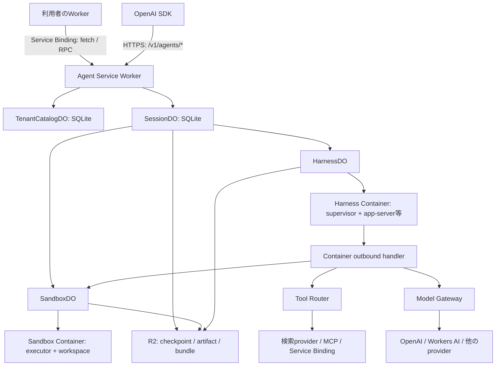

# CF-Open-Agents-API 設計案

2026-09-12時点の調査に基づく提案。
対象はOpenAIの **Agents API** と通信上の互換性を持ち、Cloudflare WorkersとしてデプロイしてService Bindingから利用できるOSSライブラリである。
本書は全体設計を記録する。
現在の実装はCodexとAI SDKを備えたalpha版であり、以下の構想をすべて実装したものではない。
実装範囲は[互換性プロファイル](compatibility.md)、検証結果は[実装記録](implementation.md)を参照する。
SQLiteのクエリとスキーマ定義にはKyselyを使い、DOの同期トランザクション内で生成SQLを実行する。
Cloudflareへの本番デプロイと実モデルの品質検証は未実施である。
調査と設計にsubAgentは使用していない。

推奨構成は、`SessionDO` がセッションの整合性を管理し、別々のContainerでハーネスと実行環境を動かす構成である。
公開API、ハーネス、Sandbox、モデル接続、ツール、スキルと知識の保存をそれぞれ交換可能な境界にする。
交換可能性は共通インターフェースだけで決まらないため、組み合わせごとの機能宣言と適合検証もライブラリの責務に含める。

## 1. API互換性の対象

OpenAIのAgents APIは、管理されたCodexハーネスと、それとは独立した実行環境を組み合わせるAPIである。
`environment.type: "none"` でもモデルと外部ツールのループを動かせる。
`codex exec-server` はシェル、ファイル、ローカルMCPなどを実行する側であり、ハーネスを置く場所には `codex app-server` が対応する。
Cloudflare環境をOpenAI管理ハーネスにつなぐ公式例はすでに存在するが、本ライブラリはハーネスも自分のCloudflare環境で管理する。
[Agents API architecture](https://developers.openai.com/api/docs/guides/agents-api/architecture)、[self-hosted sandboxes](https://developers.openai.com/api/docs/guides/agents-api/environments/self-hosted)、[Cloudflare integration](https://developers.openai.com/api/docs/guides/agents-api/environments/providers/cloudflare)。

外側にはOpenAI SDKがそのまま話せる互換ルーターを置き、内側は独自のセッションモデルにする。
API変更やハーネス追加によって、SQLiteの表や復旧手順まで一緒に変更することを避ける。
互換性は「JSONが似ている」ではなく、検証対象のSDK版と公式スキーマを固定した適合プロファイルとして公開する。
ベータAPI全体の完全互換を最初から名乗らず、対応する操作と振る舞いを明示する。

| 対象 | 最初の対応方針 |
| --- | --- |
| `/v1/agents/sessions` の作成、取得、一覧 | 対応する。作成時の初期入力とストリームも含める |
| `/v1/agents/sessions/{id}/events` | 入力送信とライブSSEに対応。メッセージ、取消、関数結果を扱う |
| セッションのitemsとturns | 安定したID、時刻、状態、ページング、保存済みの出力を再取得できるようにする |
| 保存済みagentと環境template | agentは設定のリビジョンを固定。環境templateは検証済みイメージプロファイルに対応づける |
| function toolsとMCP | 関数結果待ちとサーバー内実行を区別する |
| `environment.type: "none"` | Sandboxを起動しない構成を用意する |
| `self_hosted` executor登録 | 初期版は同梱クライアントに範囲を限定。OpenAI executorの登録、Noise relayまでの互換は別の適合項目とする |
| `openai_hosted` 相当の環境 | 拡張APIでは `cloudflare` と表現する。互換ルーターで受ける場合はCFによる代替実装であることを明示し、設定可能な環境profileに対応づける |
| native web search | 利用するハーネスとプロバイダーの対応範囲に限定。通常の関数検索をnative出力型に偽装しない |
| subagent、webhook、vault、plugin upload、ファイルAPI | 順次追加し、対応状況を項目単位で公開する |

未知の設定や未対応機能は、実行開始前に構造化エラーとして返す。
互換ルーターが返すHTTPコード、エラーbody、入力フィールド名、SSEフレーム、nullable値は固定した公式スキーマとSDKで検証する。
独自の `harness`、`modelRef`、checkpoint操作、再送可能なイベント列などは `/cf/v1/*` とライブラリ設定に置き、公式のenumへ混ぜない。

互換性に影響する振る舞いは以下である。

- idle時のメッセージは新しいturnを開始し、実行中のメッセージはそのturnをsteerする。単に次のturnへ積む実装は同等ではない。
- セッションの状態は `idle / in_progress / requires_action / failed`。turnの `completed / failed / cancelled` と混同しない。
- 公式のSSEは切断中のイベントを再送しない。再接続後は、ストリームを開いてbufferし、保存済みitemsとセッション状態を取得して表示を復元する。
- subagentは独立した履歴を持つが、公式の環境では親とファイルシステムを共有する。公式ガイドではsubagentのfunction toolsは未対応とされている。

[Run and continue sessions](https://developers.openai.com/api/docs/guides/agents-api/sessions)、[session resource](https://developers.openai.com/api/reference/typescript/resources/beta/subresources/agents/subresources/sessions/methods/list)、[events and items](https://developers.openai.com/api/docs/guides/agents-api/sessions/events)、[multi-agent](https://developers.openai.com/api/docs/guides/agents-api/multi-agent)。

## 2. デプロイ単位と責務

最初の配布形態は、npmライブラリ、Workerテンプレート、ハーネス別Container image、Sandbox imageの組み合わせにする。
利用者は必要なアダプターだけを選び、Wranglerに実在するクラスを明示的にexportしてデプロイする。
ハーネスの種類ごとに起動コマンド、イメージ、保存形式が異なるため、万能イメージへ全部を詰め込まない。



図のTool RouterとModel Gatewayは、初期版では同じWorker内のモジュールでよい。
外部連携の権限やスケール要求が分かれた時点で別Workerへ分離できるようにする。

Cloudflare Agents SDKはMCP接続やAgent実行の部品を再利用する候補である。
セッションの状態機械はまず明示的なSessionDOとして実装し、SDKの独自chat protocolをそのままAgents APIのwire contractにしない。
SDKをDOの基底に採用する場合は、SQLiteのtransaction、alarm、migrationの所有権が衝突しないことを確認して決める。
Workflowsはknowledgeの取り込みや環境準備のような段階的ジョブに、Queuesはwebhook配信やindex更新のバッファーに追加できる。
いずれもSessionDOのturn状態やハーネスのtool loopと責務を重複させない。
[Cloudflare Agents](https://developers.cloudflare.com/agents/)。

| コンポーネント | 所有する状態と責務 | 所有しないもの |
| --- | --- | --- |
| Agent Service Worker | 認証、tenant確定、互換変換、Service Binding入口 | 実行継続に必要なメモリ状態 |
| TenantCatalogDO | tenant内のagent定義、session索引、作成時の重複抑止、実行枠の予約 | 各セッションのtoken stream |
| SessionDO | turn、入力、承認待ち、items、実行世代、子agent、checkpoint参照、outbox | Linuxプロセスとworkspaceの実体 |
| HarnessDO | ハーネスContainerの起動、通信、健康状態、割当、runtime checkpoint参照 | API全体の正本 |
| SandboxDO | Sandboxの起動、コマンド台帳、workspace世代、snapshot、プロセス状態 | 会話の意思決定 |
| Harness Container | ハーネス本体とsupervisor、prompt構築、model/tool loop、native履歴 | 全tenantの資格情報、永続化の唯一のコピー |
| Sandbox Container | shell、PTY、編集、ビルド、ローカルMCP、生成物 | モデル用の長期APIキー |
| R2 | 大きいファイル、workspace snapshot、暗号化したruntime checkpoint | セッションの状態遷移の調停 |

Cloudflareの `Container` 自体がDurable Objectを継承している。
`HarnessDO` と `SandboxDO` のSQLiteは実行資源の管理に使い、別の `SessionDO` はAPI上の整合性を管理するために置く。
これによって、Sandbox交換やハーネス更新のためにコンテナを作り直してもセッションIDを維持できる。
[Container interface](https://developers.cloudflare.com/containers/reference/container-class/)。

初期配置は、セッションごとに1つのSessionDO、利用するハーネスごとに1つのHarnessDO、環境を使う場合に1つのSandboxDOとする。
同じセッション内のnative subagentはハーネス内の別threadになり得るため、子agent数とContainer数を一致させない。
別tenantを同じハーネスプロセスやSandboxへ同居させない。

Service Bindingでは `fetch()` による互換HTTPと、短い操作を行う型付きRPCを提供する。
RPCは `createSession`、`submitEvents`、`getSession` のようにし、長い処理はdurableな受付完了後にIDを返す。
SSEは `fetch()` で読み出し、ストリームの切断を実行のcancelと解釈しない。
WorkerEntrypointのインスタンスは呼び出しごとに作られるため、そこへ実行状態を保存しない。
[Service Binding RPC](https://developers.cloudflare.com/workers/runtime-apis/bindings/service-bindings/rpc/)。

ContainerからはWorkersの `env` を直接参照できない。
outbound handlerで `model.internal`、`tools.internal`、`executor.internal` などへのHTTPを受け、Worker側でBindingへ変換する。
認証はrequestの自己申告のsession IDを信用せず、`ctx.containerId` と永続化した割当から許可対象を決める。
WebSocketのUpgradeを含むexecutor経路は実機検証し、通せない場合はsupervisorによるHTTP relayか認証付きWSS入口に限定して代替する。
[Workers connections](https://developers.cloudflare.com/containers/configuration/workers-connections/)、[outbound traffic](https://developers.cloudflare.com/containers/guides/outbound-traffic/)。

TenantCatalogDOはsession一覧のために必要になる。
SessionDOの全探索を一覧APIに使わず、作成時にcatalogへ予約、SessionDOを初期化、catalogを公開可能へ確定する。
各段階は同じ作成キーで再実行できるようにし、途中で応答を失ってもsessionを二重作成しない。
一覧のID列はcatalogでpageし、変化する状態は該当SessionDOから取得する。
大きいtenantでは索引を分割し、D1を検索用projectionとして追加できるが、更新遅延のあるprojectionを強い整合性の正本として扱わない。

## 3. Codexハーネスとリモート実行

CodexAdapterは、Container内のsupervisorから `codex app-server` のstdio JSON-RPCを制御する。
外向きの認証、通信再接続、イベントの永続化、ハーネス版の管理はsupervisorとWorkerが担当する。
threadとturnの開始、steer、interrupt、approval、保存済み履歴の読み取りを共通ランタイム操作へ変換する。
app-serverのWebSocket transportやdynamicToolsには実験的なものがあるため、stdioを基本とし、採用する機能を固定リビジョンごとに検証する。
[Codex App Server](https://learn.chatgpt.com/docs/app-server)。

今回、公式リポジトリの `c4017a87aacc7558002b7cb510025e967c1d765e` を読み、次を確認した。

- `environments.toml` に `default`、`include_local`、WebSocket URLを持つ環境一覧を記述する実装がある。
- exec-serverにはprocessとfilesystemのRPCがある。ファイル操作のwire形式には `file:` URIを使う。
- リモート環境へのshellとapply_patchのルーティングを確認する上流テストがある。
- app-serverが選択環境のAGENTS.mdをモデル入力へ渡す上流テストがある。

[environment設定の実装](https://github.com/openai/codex/blob/c4017a87aacc7558002b7cb510025e967c1d765e/codex-rs/exec-server/src/environment_toml.rs)、[exec-server仕様](https://github.com/openai/codex/blob/c4017a87aacc7558002b7cb510025e967c1d765e/codex-rs/exec-server/README.md)、[remote環境テスト](https://github.com/openai/codex/blob/c4017a87aacc7558002b7cb510025e967c1d765e/codex-rs/core/tests/suite/remote_env.rs)、[選択環境テスト](https://github.com/openai/codex/blob/c4017a87aacc7558002b7cb510025e967c1d765e/codex-rs/app-server/tests/suite/v2/selected_environment.rs)。

これはソース確認であり、公開npm版への搭載やCloudflareでの動作を確認した結果ではない。
それでも、分離をゼロから実装する前に上流のremote environmentを使う根拠になる。
接続案は次の通りである。

```text
Harness Container
  supervisor
    ├─ stdio → codex app-server
    └─ loopback WebSocket bridge
                    ↓ 認証付き接続
              Worker / SandboxDO
                    ↓
Sandbox Container
  codex exec-server
  /workspace
```

ハーネス側の環境選択では `include_local = false` にして、モデルに利用者コードをハーネスContainerで実行させない。
設定でlocalhost bridgeを参照し、bridgeが外向き接続の認証を処理する。
確認したTOMLのURL設定は任意HTTP header設定を公開していないため、外部接続の秘密情報をURLへ埋め込む設計を避ける。
OpenAIの登録APIとNoise relayを複製する必要は、直接接続の方式では発生しない。

Sandbox imageはCloudflare Sandbox SDKの機能とCodex executorを同居させる。
管理側はSDKでライフサイクルとsnapshotを扱い、Codexのnative実行はexec-serverが担当する。
SDKのprocess handleとexec-serverのprocess IDを混同せず、バックアップ、restore、破棄を行う時は両経路の実行を停止する。
executorとの接続断によってプロセスがどう扱われるかは、固定版のコードと実機で検証する。
接続の再開とプロセスの存続は別の保証である。

Code Modeも、モデルが生成したコードを動かす場合は実行環境として扱う。
remote Code Mode hostの選択肢はあるが、shellのremote environmentと同じ機能ではない。
有効化するなら別の隔離実行系へ置くかSandbox内へ配置し、ハーネスにモデル生成コードを実行させないことを検証する。

上流経路が必要な機能を満たさない場合は、ExecutionBackendへの小さいアダプターパッチを検討する。
MCPやdynamic toolsで独自shellを公開する方式は代案だが、native toolの停止、編集形式、approval、PTY、skill読込みまで検証する。
MCPを追加しただけで、ハーネスの内蔵Bashやファイル操作の実行先が切り替わったとは扱わない。

## 4. Sandboxの契約

Sandboxの共通インターフェースは、実行を始める操作と実行を観測する操作を分ける。
文字列コマンド1つだけのインターフェースでは、PTY、stdin、並列実行、cancel、再接続後の出力取得を表現できない。
次はライブラリの設計用型であり、Cloudflare SDKの実際の型を転載したものではない。

```ts
interface SandboxBackend {
  ensure(spec: SandboxSpec): Promise<SandboxHandle>;
  spawn(handle: SandboxHandle, request: ExecRequest): Promise<ProcessRef>;
  readOutput(ref: ProcessRef, after?: string): Promise<OutputPage>;
  writeStdin(ref: ProcessRef, bytes: Uint8Array): Promise<void>;
  terminate(ref: ProcessRef): Promise<TerminationResult>;
  readFile(handle: SandboxHandle, path: string): Promise<FileResult>;
  writeFile(handle: SandboxHandle, request: FileWrite): Promise<FileRevision>;
  checkpoint(handle: SandboxHandle): Promise<WorkspaceCheckpoint>;
  restore(checkpoint: WorkspaceCheckpoint): Promise<SandboxHandle>;
  destroy(handle: SandboxHandle): Promise<void>;
}

interface ExecRequest {
  operationId: string;
  generation: number;
  argv: string[];
  cwd: string;
  env: Record<string, string>;
  tty: boolean;
  deadline: number;
  outputLimitBytes: number;
}
```

Cloudflare Sandbox SDKにはstable系と1.0 preview系があり、後者はargvで起動してprocess handleを返す設計である。
この契約はpreviewの方向性に合わせるが、実際に採用するパッケージとContainer imageは同じ版系列で固定する。
previewの実行APIとstableのbackup APIの組み合わせを、文書だけで利用可能と決めない。
現在のstable版にもアダプターを用意できる形にしておく。
[Sandbox 1.0 preview](https://developers.cloudflare.com/sandbox/1-0-preview/)。

初期版はshellとLinuxが必要な用途をCloudflare Containerに限定する。
Linuxを必要としない独自ハーネスや小さい計算用には、将来Workers系の別SandboxBackendを追加できる。
Containerのportはデフォルトで内部利用とし、preview公開は利用者が指定した対象にだけ短期アクセスを許可する。

## 5. 永続化と障害時の振る舞い

「セッションが続く」「ファイルが戻る」「同じプロセスが走り続ける」は別々の保証として定義する。
Cloudflare Containerのディスクとメモリは、セッションの永続化先として頼らない。
Durable ObjectのSQLiteはContainer再起動後も残る一方、workspaceは明示的にR2へcheckpointする。
[Durable Object storage](https://developers.cloudflare.com/durable-objects/best-practices/access-durable-objects-storage/)、[Container interface](https://developers.cloudflare.com/containers/reference/container-class/)。

| 保存対象 | 正本 | 復元方法 |
| --- | --- | --- |
| API入力、turn、items、承認、関数結果 | SessionDO SQLite | 保存済み状態を読み出す |
| ハーネス固有の履歴とcompaction状態 | 版を付けたruntime checkpoint | 同じハーネス版へ戻す |
| workspaceのファイル | R2のimmutable checkpoint | Sandboxを起動してrestore |
| artifact、添付、skill bundle、原文資料 | R2 | 内容hashで参照 |
| プロセス、PTY、ソケット | 実行中Containerのみ | 消失時は失敗または明示的な再実行 |
| tenant横断検索用メタデータ | catalog、将来D1 projection | sessionの状態から再構成 |

共通の会話履歴とnative checkpointは両方保存する。
共通履歴はAPIや検索に使い、native checkpointは同一ハーネスでの再開に使う。
隠れた内部状態を共通メッセージ列だけから完全復元できるとは約束しない。
native checkpointには認証ファイルを含めず、必要な機密データは暗号化して保存する。
SQLiteのruntime状態を保存する場合は、そのハーネスが提供するexportか整合したbackupを使い、稼働中のDBファイルだけをコピーしない。

SessionDOに必要な論理表は次の通りである。
これはスキーマ設計の粒度を示すもので、実装済みSQLではない。

```text
session_state       設定snapshot、API状態、root agent、削除状態
agents              parent、native ID、harness、modelRef、状態
turns               agent ID、状態、開始/完了、usage、error
inputs              入力イベント、idempotency key、処理段階
items               turn ID、種別、順序、状態、content/artifact参照
required_actions    function call / approval / environment接続待ち
execution_attempts  attempt ID、実行世代、lease、heartbeat
tool_calls          operation ID、引数hash、実行先、結果、再実行可否
checkpoints         workspaceとruntimeの組、版、durable boundary
events              内部seq、native event key、型、payload参照
outbox              未配信の起動、取消、通知、索引更新
```

入力受付は、重複判定、入力の記録、状態遷移、outboxへの起動要求追加を同じSQLite transactionで行う。
その後に外部I/Oを実行する。
長い処理を `blockConcurrencyWhile()` や1本のHTTP requestへ閉じ込めず、DO alarmで未完了のoutboxとleaseを再確認する。
1つのDOのalarmは1つなので、期限を持つ作業を表に持ち、最も近い期限へalarmを設定する。
単なる `waitUntil()` だけを長時間実行の継続保証にしない。

turnが生きている間も短いheartbeatと状態取得で監視し、Workerの再起動後には実行中プロセスを照合する。
実行中のハーネスが見つかったら再接続し、消失していたら復旧判定へ進む。
承認待ちや長い外部関数待ちではcheckpointした上でContainerを停止できるが、未完了approval requestをnativeハーネスへ復元できることが条件になる。

**実行世代**を単調増加させ、旧attemptから遅れて届いた書込みを拒否する。
ただしWorkerでcallbackを拒否するだけでは、旧executorが持つshellプロセスは止まらない。
新しい書込み実行を開始する前に旧プロセスの終了を確認し、確認不能なら旧Sandboxを隔離して新しいContainerへ復元する。
外部書込み用の権限はWorker側で失効できる短期権限にする。

一般のshellや外部APIにexactly-onceは保証しない。
`operationId` で受付と結果を重複抑止し、既存プロセスと結果の照会で可能な限り確定する。
「外部書込みは成功したが結果が保存される前に停止した」場合は、状態を `outcome_unknown` として内部に残す。
読み取り、または下流も同じidempotency keyを保証する処理だけ自動再実行し、それ以外は失敗通知または明示的な再開操作を要求する。
外側のAPIでは固定スキーマに対応するturn失敗として表現し、独自状態名を公式enumへ追加しない。

checkpointは次の順序で確定する。

1. 同じworkspaceへ書き込む全agentと管理操作を止め、安全な境界を作る。
2. workspaceのsnapshotとnative runtimeのsnapshotを作り、R2の新しいキーへ保存する。
3. 対応する入力位置、履歴位置、tool結果、両snapshot参照をSessionDOのtransactionでcommitする。
4. このcommitをdurable boundaryとし、停止可能にする。
5. 参照されなかった中間snapshotは後で回収する。

R2とDOをまたぐtransactionはないため、アップロード完了前に「最新checkpoint」の参照を更新しない。
整合したsnapshot対が作れないハーネスでは、turn完了境界だけで再開を保証する。
予期しない停止に備える保証範囲は「最後にcommitした境界まで」と明記し、turn途中の全ファイル書込みが戻るとは約束しない。
durable完了を提供するprofileでは、checkpointの確定後に公開turnのcompletedをcommitして配信する。

Sandbox SDKのbackupはディレクトリのsnapshotであり、プロセスメモリのsnapshotではない。
本番restoreはFUSE overlayを使い、ローカルの `wrangler dev` と挙動が異なる。
restore後の変更は元のR2 archiveへ自動反映されず、次のbackupが必要になる。
`EXDEV` が発生し得るrenameと生成cacheも実機検証に含める。
[Directory backups](https://developers.cloudflare.com/sandbox/concepts/backup-restore/)。

R2 mountは外部データ置き場に使い、workspaceやSQLite DBに一般的なPOSIXディスクと同じ保証を期待しない。
backupの有効期限とR2 object削除は別管理なので、セッション保持期間以上の有効期限と、参照を考慮した回収規則を持つ。
削除はまずsessionをtombstone化して新規実行を拒否し、両Containerを停止、参照blobを回収、catalogを更新する。
共有bundleは参照が残る限り削除しない。
[Backup API](https://developers.cloudflare.com/sandbox/api/backups/)。

内部eventには単調増加のseqを与え、重複するnative eventを取り込まない。
セッションとitemsの変更をcommitしてから外へ通知する。
高頻度のtoken deltaは短時間でまとめ、保持量を制限し、低速subscriberが実行を止めないようにする。
独自APIにreplayを設ける場合は、cursor、保持期限、欠落を示すエラーを定義する。
公式互換SSEには、公式仕様に存在しないreplay保証を追加したことにしない。

## 6. ツールと検索

ツールの定義と、どこで実行するかを分離する。
JSON Schema、結果のcontent、artifactとcitation、実行権限、deadline、idempotency方針を共通契約にする。
MCPはこの契約を外へ出すアダプターの1つとし、ライブラリ内部までMCP transportへ固定しない。

```ts
interface ToolDefinition {
  name: string;
  description: string;
  inputSchema: JsonSchema;
  outputSchema?: JsonSchema;
  execution: "worker" | "service" | "sandbox" | "client" | "native";
  effects: "read" | "workspace-write" | "external-write";
  retry: "safe" | "idempotency-required" | "never-automatic";
  requiredPermissions: string[];
}

interface ToolContext {
  tenantId: string;
  sessionId: string;
  agentId: string;
  turnId: string;
  operationId: string;
  generation: number;
  deadline: number;
}

interface ToolResult {
  content: ContentPart[];
  structuredContent?: JsonValue;
  artifacts?: ArtifactRef[];
  citations?: Citation[];
  error?: ToolError;
}
```

`execution: "client"` は公式function toolの流れに対応し、SessionDOへrequired actionを記録して結果入力を待つ。
`worker` と `service` は登録済みの実装をWorker側で実行し、結果をハーネスへ返す。
両者を区別しないと、呼び出し元がまだ結果を返していないのにturnが進むなど、互換動作が壊れる。
schema、権限、出力量、timeoutはtrustedなTool Routerで検証し、MCPのreadOnlyHintだけをセキュリティ境界に使わない。

プリセットは、設定と依存するproviderを束ねるfactoryとして提供する。

| プリセット案 | 内容 | 注意点 |
| --- | --- | --- |
| `coding()` | exec、stdin、file、patch、artifact | Codexには検証済みnative executorを優先する |
| `web({ search })` | web検索、URL取得、本文抽出、引用情報 | search providerを明示的に差し込む |
| `knowledge({ retriever })` | 文書検索、原文とchunk取得 | tenantとcorpus revisionを固定する |
| `browser({ backend })` | 動的ページ、画面取得、ブラウザー操作 | 必要な時だけBrowser Run等を使う |
| `mcp({ servers })` | HTTP MCP、必要ならSandbox側stdio MCP | サーバー設定と資格情報を分ける |

検索には `WebSearchProvider.search()` と `WebFetcher.fetch()` を用意する。
検索結果はURL、title、snippet、取得時刻、利用できる場合の公開時刻を含み、本文はartifactとして別保存する。
web fetchではredirect先もアクセス規則を確認し、private addressや管理endpointへの到達を制限する。
検索結果やページ内の文章は外部データとして取り込み、サービスの実行権限を変更させない。

Cloudflare AI Searchは登録したデータを検索する用途に使える。
一般Web全体の検索providerとは役割が異なるため、knowledge presetの既定候補にする。
細かなchunk構成やembeddingモデルを制御したい場合はVectorize等を実装するRetrievalBackendへ差し替える。
[Cloudflare AI Search](https://developers.cloudflare.com/ai-search/)。

Codexの組込みweb searchは、対応するモデルproviderとハーネス機能に依存する。
通常ツールのweb検索はCodexにはMCPまたは検証済みdynamic toolで公開し、native web searchは別capabilityとして有効化する。
同じ機能を両方出す場合も、利用方針と名前を明確にする。
共通schemaが同じでも、tool名、説明、編集形式を各ハーネスに合わせるadapterが必要になる。
[Codex provider configuration](https://learn.chatgpt.com/docs/config-file/config-reference)。

## 7. スキル、ナレッジ、メモリ

手順を教えるskill、参照資料としてのknowledge、過去の利用から得るmemoryを分ける。
それぞれ更新主体と検索方法が異なるため、全部をsystem promptへ埋め込む構成にしない。

| 対象 | 保存と読込み | ハーネスとの接続 |
| --- | --- | --- |
| Skill | SKILL.mdと補助ファイルをimmutable bundle化。ID、version、hash、要求権限を記録 | metadataだけ先に提示し、必要時に本文やscriptを取得 |
| Knowledge | 原本はR2、検索indexはRetrievalBackend。出典位置と文書版を持つ | `knowledge.search` と `knowledge.read` |
| Memory | tenant、agent、user、projectのscopeを持ち、出典、期限、更新記録を保存 | 明示的なmemory読込みと更新ツール |

セッション作成時にskill bundleとknowledge revisionを固定し、途中の自動更新で再現性を壊さない。
動的なknowledge更新を許すprofileでは、各検索結果に実際に参照したrevisionを記録する。
知識の削除やアクセス取消では、indexの削除完了を待たずretrieval時の権限確認で読込みを拒否する。

skillの説明と手順はハーネス側が読み、skill内のscriptはSandboxで実行する。
パス参照を壊さないよう、bundleを同じ内容hashと配置規約で渡す。
trustedな登録bundleと、workspace内でagentが編集したファイルを別の信頼区分にする。
pluginに含まれるMCPやコードの実行先をmanifestで宣言し、skillの文章だけで追加権限を与えない。

Codex形式のpluginを取り込むadapterを用意するが、coreのbundle契約は特定ハーネスのmanifestに固定しない。
OpenAIのpluginはskillとMCP設定を束ね、self-hosted環境では `capability_directories` に配置する仕組みである。
CodexAdapterはこの形式へのmaterializeを担当し、ClaudeやOpenCodeへの配置は各adapterが担当する。
[Agents API plugins](https://developers.openai.com/api/docs/guides/agents-api/tools/plugins)。

## 8. 複数ハーネスとモデル接続

ハーネスはエージェントの動き方を決め、モデルproviderは推論の接続先を決める。
設定ではこの2軸を独立させる。
利用者が `harness: "codex"` を `"opencode"` に変えられる体験を目指すが、その変更は新しいセッションの作成時に適用する。
必要なadapterとimageをデプロイ済みで、モデルと機能の組み合わせが適合することを前提にする。

| ハーネス | 統合経路 | 最初に確かめる点 |
| --- | --- | --- |
| Codex | app-serverとremote exec-server | remote環境、native tool、checkpoint、Responsesの対応範囲 |
| OpenCode | `opencode serve` とSDK | native filesystemやBashの分離、非同期入力の意味、保存履歴 |
| Claude Code | Claude Agent SDKを動かすContainer wrapper | 内蔵ツールの制限とremote tool差し替え、resume、対応する認証とprovider |
| DeepSeek Harness | plugin/serviceを組み込むContainer wrapper | model、sandbox、session persistenceの接続、preview版の変更 |
| Cloudflare Think | 別DOで動くThinkAdapter | AI SDKモデルの直接利用、tool境界、steerとcancelの互換性 |
| 将来の軽量ハーネス | WorkersまたはContainer上の独自loop | AI SDKの直接利用と共通tool契約 |

OpenCodeはHTTP serverとSDKを公開している。
Claude Agent SDKはcustom toolのMCP登録と内蔵tool一覧の制限を提供する。
DeepSeek Harnessの公式previewはモデル、Sandbox、session、storageなどをpluginに分けている。
実装ではClaude SDKの `toolAliases` とOpenCodeの同名plugin toolを使って、Bash・Read・Write・Editを別Sandboxへの呼び出しに差し替える。
固定バージョンの実プロセスで確認しており、対応範囲と検証方法は [extending.md](extending.md#sandbox-replacement) に記載する。
DeepSeek HarnessとThinkは引き続き追加候補である。
[OpenCode server](https://opencode.ai/docs/server/)、[Claude custom tools](https://code.claude.com/docs/en/agent-sdk/custom-tools)、[DeepSeek Harness](https://www.deepseek.com/harness/en/)。

Cloudflareの `@cloudflare/think` も追加候補になる。
公式ドキュメントにはAI SDKのモデルを返す `getModel()`、SQLiteを使った履歴、tool loop、subagent RPCがある。
Workers AIや任意のAI SDKモデルを使う標準的なagentには、Codex向けのprotocol変換を通さずこのadapterを使う構成を提供できる。
ThinkはSessionDOを置き換える親ハーネスとして使わず、ほかのハーネスと同じRuntimeRefの背後に配置する。
この場合の実行資源はContainer付きHarnessDOではなくThinkのDOであり、Linuxが必要なtoolだけSandboxへ送る。
Thinkの復旧機能と公開Agents APIの状態を対応づける検証は別途必要になる。
[Cloudflare Think](https://developers.cloudflare.com/agents/harnesses/think/)、[Think durable recovery](https://developers.cloudflare.com/agents/harnesses/think/recovery/)。

```ts
interface HarnessAdapter {
  id: string;
  capabilities: HarnessCapabilities;
  validate(spec: SessionSpec): CompatibilityReport;
  provision(spec: SessionSpec, bindings: RuntimeBindings): Promise<RuntimeRef>;
  submit(runtime: RuntimeRef, input: HarnessInput): Promise<InputReceipt>;
  inspect(runtime: RuntimeRef): Promise<RuntimeState>;
  cancel(runtime: RuntimeRef, target: CancelTarget): Promise<CancelReceipt>;
  checkpoint(runtime: RuntimeRef): Promise<HarnessCheckpoint>;
  dispose(runtime: RuntimeRef): Promise<void>;
}
```

これは永続的な制御契約である。
イベント配送は認証付きのpushまたはcursor付きpollを別に設け、JavaScriptのAsyncIteratorをDBへ保存しない。
取得時点でしか有効でないRPC stubや実行中Promiseもcheckpointへ保存しない。

capabilityには、`midTurnSteering`、`externalExecution`、`nativeResume`、`durableToolPause`、`nativeSubagents`、`dynamicTools`、`structuredOutput`、モデルのwire protocol、content種別を含める。
未対応のsteerを勝手に「次turnへqueue」に変えず、互換profileで必要ならsession作成時に拒否する。
portable profileでは機能を減らす選択を明示できる。

実行中や再開時のハーネス変更は、単なるenum変更にしない。
同一ハーネスはnative checkpointからresumeし、異なるハーネスへ移る時は共通履歴、workspace checkpoint、指示から新しい分岐を作る。
compaction、内部reasoning、保留tool requestの移行可否を検証し、失われる状態を移行結果へ記録する。

モデルは **Model Registry** に登録する。
永続化するのは `modelRef`、provider設定のrevision、秘密情報の参照であり、AI SDKのLLMインスタンスそのものではない。
サービス起動後、bindingを受け取るfactoryが実インスタンスを再生成する。
利用者Workerから差し込む場合は、再接続できるService Bindingのmodel serviceを登録する方式も提供する。

```ts
// 提案API。実装済みライブラリや動作確認済みサンプルではない。
const service = defineAgentService({
  harnesses: {
    codex: codexAdapter({ imageProfile: "codex-pinned" }),
    opencode: openCodeAdapter({ imageProfile: "opencode-pinned" }),
  },
  models: {
    primary: responsesModel({ endpointRef: "primary-provider" }),
    workers: aiSdkModel({
      create: (env) => makeWorkersAiModel(env.AI, env.WORKERS_MODEL_ID),
    }),
  },
  sandboxes: {
    linux: cloudflareSandbox({ imageProfile: "linux-pinned" }),
  },
  profiles: {
    coder: {
      harness: "codex",
      modelRef: "primary",
      sandboxRef: "linux",
      toolPresets: [coding(), web({ search: configuredSearchProvider })],
    },
  },
});
```

上のfactoryはデプロイされるコードである。
HTTPのsession作成やDO storageを通じて任意の関数を送るAPIにはしない。
インプロセスのAI SDKモデルは直接使い、Container内のCLIにはModel Gatewayがハーネスの期待する通信形式を提示する。
Codexのcustom providerは現在Responses形式を使うため、任意のChat Completions endpointをそのまま設定する設計にしない。
[Codex configuration](https://learn.chatgpt.com/docs/config-file/config-reference)。

Model Gatewayの優先順位は、対応するnative protocolの透過転送、既存gatewayの利用、必要範囲に限定した変換の順にする。
OpenAI Responses、Chat Completions、Anthropic Messagesの変換が必要なら、tool call ID、streaming、usage、reasoningの扱い、画像、エラー、cancelを適合検証する。
未対応フィールドを黙って落とさず、設定時に拒否するか、portable profileで許可された劣化だけ行う。
ハーネスがtool loopを所有するので、Model Gateway側のAI SDK呼出しで第2のagent loopを走らせない。

CloudflareはWorkers AIのAI SDK providerとResponsesの利用例を公開しており、AI GatewayにもResponses互換endpointがある。
これを接続候補にできるが、Codexが送るリクエスト全体への互換性はendpoint名だけで証明できない。
固定したモデルごとにtool callingとstreamingを検証する。
[Workers AI with AI SDK](https://developers.cloudflare.com/workers-ai/configuration/ai-sdk/)、[OpenAI compatibility](https://developers.cloudflare.com/workers-ai/configuration/open-ai-compatibility/)、[AI Gateway REST API](https://developers.cloudflare.com/changelog/post/2026-05-21-rest-api/)。

モデル選択時は、モデル名より先に1turnと1sessionの予算、最大出力、timeout、同時実行数を決める。
sessionにはaliasの解決結果を保存して、再開時にalias更新でモデルが勝手に変わらないようにする。
providerが返すusageはbest effortとして記録し、確定前の並列要求には予約予算を割り当てる。
途中で別モデルへfallbackする場合は、新しいattemptとモデル変更を記録する。

## 9. ライブラリが提供するsubagent

この設計上のsubagentは、今回の設計作業でsubAgentを使用しないという制約とは別である。
セッション内ではrootと子agentのID、parent ID、独立した履歴、turn、実行先、モデル、権限、予算を保存する。

nativeなsubagentと、プラットフォームが新しいハーネスを起動するsubagentを分ける。
Codex同士のnativeな委譲はハーネスに任せ、adapterはイベントと親子関係をSessionDOへ同期する。
異なるハーネスやモデルを使う委譲は、登録済みprofileを指定する `agents.spawn` 相当の拡張ツールを提供する。
同じ親のスケジューリングをnative側とSessionDOの両方で重複実装しない。

混在型subagentのspawnはSessionDOで子IDとoutboxを同時に記録し、同じoperation IDなら同じ子を返す。
親が待っている間に停止しても、子の状態を再取得して続行できるようにする。
共通APIはcreate、send、wait、interrupt、closeを表現し、各ハーネスのnative能力との差はadapterに閉じ込める。

Workspace方針はprofileで選ぶ。

| モード | 利用場面 | 保証 |
| --- | --- | --- |
| shared | 公式互換profile、協調して同じ環境を使う処理 | 同じworkspace。競合する書込みは別途調停する |
| worktree | 同じrepositoryへの分担作業 | Git上の作業分離。秘密情報やプロセスの隔離にはならない |
| isolated | 異なる信頼区分、混在ハーネス | checkpointから別Sandboxを作る。成果物かpatchを明示的に統合 |

互換profileで勝手にisolatedへ変更しない。
拡張profileではisolatedを既定候補にし、不要なSandboxは作らない。
worktreeをcheckpointする場合はGitの共通ディレクトリへの参照も含めるか、独立して復元できる形へ変換する。

子の権限は親の権限の部分集合に限定する。
セッションの最大並列数、最大深さ、総token予約、実時間、Container枠を共通管理する。
native subagentへ確実に予算や実行先を伝播できないadapterでは、その機能を予算厳守profileで有効にしない。
root turnのcancel、子1体のinterrupt、session全体の停止を別操作として扱い、全体停止ではleaseと外部実行権限を失効させる。

## 10. 実装順序と受け入れ条件

最初に難所を実証し、その結果から公開APIの細部を確定する。
4種類のハーネスを同時に実装するより、Codexでnative機能を使い、もう1種類で抽象化を検証する順がよい。
実装済みのハーネスはCodex、Claude Code、OpenCodeである。
DeepSeek Harnessを追加する場合も、既存の実行・checkpoint境界を満たすadapterとして接続する。

| 段階 | 作るもの | 合格条件 |
| --- | --- | --- |
| 0 | Codex app-serverとexec-serverを別CF Containerへ配置するspike | shell、patch、PTY、AGENTS.md、skill、MCPが意図した側で動く。秘密情報と実行先の越境がない |
| 1 | SessionDO、catalog、互換HTTP、Service Binding | 固定したOpenAI SDKから作成、入力、SSE、items、継続、steer、cancel、function結果返却が通る |
| 2 | R2 checkpointと復旧 | idle停止後の履歴とファイル復元、DO再起動、Container消失、結果ACK消失を区別して扱う |
| 3 | 共通tool、検索preset、skills、knowledge | providerの差し替えで利用側のAPI変更が不要。引用と権限scopeを維持する |
| 4 | 第2ハーネスとWorkers AI | 対応profileはharness/modelRefの変更で同じ適合テストを通り、非対応組合せは開始前に拒否する |
| 5 | nativeと混在型subagent、webhook、追加互換項目 | 親停止からの復帰、子の独立履歴、共有/隔離workspace、総予算の制御を確認する |

最初のspikeでは最新版を追い続けず、確認したsource revisionからビルドするか、その機能が搭載された公開artifactを選び直して固定する。
型生成、Container image、supervisor protocol、native checkpointの各版をmanifestに残す。
上流のテストを読んだことを、自分たちのCloudflare環境でテストが通った証拠として扱わない。

次の障害シナリオを最小の統合検証へ含める。

- 同じ入力を2回送信して、受理済みの作業を重複実行しない。
- 外部toolが実行された直後に接続を切り、結果不明の書込みを自動再実行しない。
- SessionDOだけを再起動し、実行中ハーネスへ再接続できる。
- ハーネスContainerとSandbox Containerを別々に失い、checkpointと実行消失を区別できる。
- checkpoint upload後、DO commit前に停止しても、壊れたsnapshot参照を公開しない。
- cancel後の遅延callbackと旧世代の実行要求を拒否する。
- SSE切断後に保存済みitemsで復元し、公式にないreplayへ依存しない。
- 本番のFUSE restoreで、Gitとビルドを含む次turnを完了できる。
- 子agentからの別tenant参照と権限拡張を拒否する。

CF本番特有の通信とstorageの検証は、実際の隔離したCloudflare環境で行う必要がある。
本書の時点ではすべて未実施であり、実装着手後の受け入れ条件として残す。

初期package境界は `core`、`cloudflare`、`compat-openai`、`harness-codex`、`sandbox-cloudflare`、`tools`、`model-ai-sdk` を候補とする。
`core` はCloudflareや個別CLIをimportせず、依存オブジェクトを渡す。
DOクラスとイメージ設定はdeployment側に置き、SDKの内部クラスを公開契約へ漏らさない。
公開するpackage数は実装規模に応じてまとめてもよい。

コスト設計では、ハーネスとSandboxを分離した分だけ、稼働中のContainerメモリとディスクの費用が増える。
Containerは稼働時間中の割当メモリとディスク、実使用CPUなどに課金され、停止すればContainerの稼働課金は止まる。
小さいハーネス用image、Sandboxの遅延起動、checkpoint後の停止、子agentの同時実行制限を既定動作にする。
具体的なinstance typeは、Codexの起動時と長い履歴再開時のピークメモリを測ってから選ぶ。
[Container pricing](https://developers.cloudflare.com/containers/platform/pricing/)、[instance limits](https://developers.cloudflare.com/containers/platform/limits/)。

この設計で最初に固定する判断は、SessionDOを正本とすること、ハーネスとSandboxを別実行資源にすること、ハーネスとモデルを独立して設定すること、公式互換と独自拡張を分離することである。
Codexのremote executor経路とdurable checkpointを実証できれば、残りのアダプターを追加するための境界が定まる。
