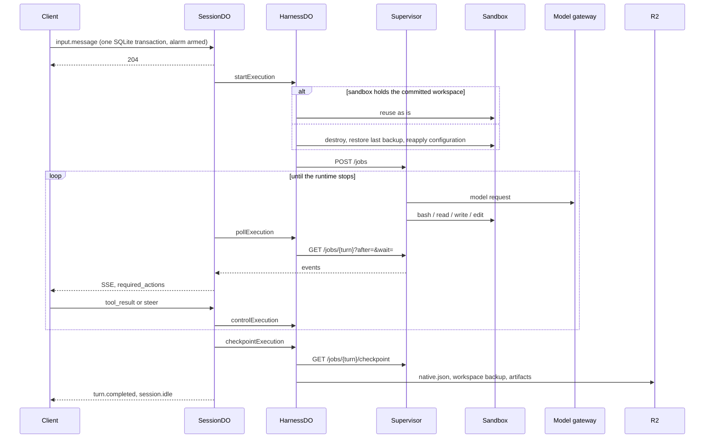

# Architecture

CF-Open-Agents-API implements the [compatibility profile](compatibility.md) on Cloudflare Workers. HTTP clients and trusted Service Binding callers share one durable session implementation. The native runtimes (Codex, Claude Code, OpenCode) own their agent loops; this project owns the API, the sandboxes, the model gateway and durability.

## Service boundaries

| Component                     | Responsibility                                                                                            |
| ----------------------------- | --------------------------------------------------------------------------------------------------------- |
| AgentWorker                   | Authentication, wire validation, tenant routing, HTTP routes and the typed RPC surface                    |
| TenantCatalogDO               | Per-tenant agents, templates, skills, vaults, input files, session discovery and idempotency reservations |
| SessionDO                     | One session: input log, turns, required actions, output items, execution identity and the event log       |
| HarnessDO                     | One session's execution: sandbox assignment, model and tool egress, delegated children, checkpoints       |
| Harness Container             | The Node supervisor and the selected native runtime; no Internet access                                   |
| SandboxDO / Sandbox Container | `/workspace`, shell, files, Codex `exec-server`, environment-origin MCP servers                           |
| `Models` entrypoint           | The private model gateway: deployment-owned model names, provider credentials, protocol translation       |
| R2                            | Native checkpoints, workspace backups, input files, skill bundles, environment configuration, artifacts   |
| `CODE_LOADER`                 | Dynamic Workers that run model-written code for programmatic tool calling                                 |

The public `agent.model` selects a deployment preset that maps to a harness and a gateway model name. A session pins the harness revision and the model name at creation. Changing a preset affects new sessions only. Clients cannot supply provider URLs, credentials, container images, binaries or host paths.

## A turn, end to end

## Durable execution

SessionDO stores records and an ordered event log in SQLite behind a typed repository seam: Kysely compiles the SQL, `SqlStore` executes it synchronously, and every state transition is a synchronous function of a `SessionTx` that runs inside one `transactionSync`, so input validation, turn creation, queued commands and emitted events commit together and a thrown rule rolls them back as one. Network I/O runs outside those transactions as Effect programs on the object's runtime, which is why new input can arrive while the reconciler is waiting on the runtime.

Every execution carries a session ID, a turn ID and an increasing generation. A transition that follows I/O takes a `Fenced<ActiveSession>`: the record as the writing transaction re-read it and matched it to the execution. A stale identity fails with `Superseded` and the tick ends silently; a transition on a record read before the I/O does not compile. A Durable Object alarm drives the reconciler. While a turn is active the alarm is re-armed before the reconciler takes its permit, so a busy reconciler can never consume the only wake-up, and again once the tick settles, one interval after the alarm fired. Within a tick the reconciler long-polls the runtime for the rest of its interval and keeps polling while events arrive, so streaming latency follows the runtime rather than the alarm (`pollIntervalMs`, 5 seconds by default). SQLite stays authoritative after eviction.

Start and control operations use stable operation IDs. HarnessDO writes a dispatch marker and posts the job to the supervisor as one uninterruptible step; a retry can inspect a lost job but never replay it. A job that was acknowledged and then vanished fails with `outcome_unknown`, because the input log does not prove whether side effects already happened.

Queued commands never block polling. A command the runtime refuses for good (`CommandRejected`, `ExecutionMissing`) is dropped: a refused steer becomes the next turn's input, a refused tool result is discarded. A transient delivery failure (`TransportFailure`) is retried after the next poll, so a turn the runtime already finished can still be sealed. Cancellation has its own durable record and supersedes queued steers and tool results.

The reconciler's error policy is a type. A definite answer (`RuntimeRejected`, a runtime protocol violation, an unstorable record, an executor the deployment no longer registers, a harness revision mismatch) fails the turn at once with the code it projects to. A transport or storage failure propagates to the alarm, which logs it and retries on the next interval until the turn deadline (`request_timeout`). The stop that precedes sealing a turn is bounded the same way: past the deadline a stop that still fails no longer holds the turn open, and the turn is sealed as `outcome_unknown` because nothing confirmed that the runtime's side effects ended. The program itself, its services and the fence are described in [effect.md](effect.md#the-reconciler-tick).

## Turn outcomes

A turn ends `completed`, `cancelled` or `failed`. A failed turn carries a `SessionTurnError` whose `code` is one of the SDK's public codes; any other string becomes `internal_error` with the original string as the message. The reconciler's own reasons (`executor_unavailable`, `executor_failed`, `checkpoint_unavailable`, `subagent_start_failed`) are such messages, not codes.

Only an indeterminate outcome leaves the session `failed`: `outcome_unknown`, `programmatic_execution_uncertain`, or any other `*_uncertain` code. Every other failed turn returns the session to `idle` with `session.error` set, and the next turn restores the last committed checkpoint. A `failed` session accepts no further input; fork it to continue.

## Checkpoints and recovery

A finished turn enters `checkpointing`. The supervisor stops the native process, then captures its home directory (history databases, transcripts, native subagent state). HarnessDO stores that snapshot in R2 under an immutable per-generation key, backs up `/workspace`, publishes `/workspace/outputs` as artifacts (a manifest committed before any upload, then four files at a time, each copy interruptible on its own), and records the checkpoint locally. The R2 puts a durable record will name are uninterruptible, so an interrupted fiber observes their outcome instead of leaving it unknown. SessionDO commits the checkpoint references under the fence and exposes `completed` only after they are committed.

Checkpoint retries read the recorded checkpoint directly and do not poll a native process that may be gone, so a lost response is recovered even after the container disappears. A checkpoint is attempted after the deadline as well, since the result may already be committed; only a failure to answer after the deadline fails the turn, with the message `checkpoint_unavailable` under the public code `internal_error`. The harness revision is checked before a checkpoint is restored. Codex uses a stable home path because its database stores absolute rollout paths. Checkpoints hold files, not processes, sockets or external effects.

## Sandbox reuse

HarnessDO records which workspace backup the live sandbox holds, both durably and as a marker file inside the container. When the next turn starts from that same committed workspace, the sandbox is reused as is, including state outside `/workspace` such as installed packages and files written by setup commands. Anything else (a cancelled or failed turn, a container the platform replaced, a fork adopting a workspace) destroys the sandbox, restores the last committed backup from R2, and reapplies the environment configuration. The deployment provisioning hook runs once per fresh workspace. Explicit environment uploads are reapplied from a durable file journal on restore. Setup-command effects outside `/workspace` therefore persist across reused turns and are discarded on restore; see [SECURITY.md](../SECURITY.md).

## Sessions, deletion and forks

Session creation reserves the idempotency key in the tenant catalog, initializes the SessionDO, prepares the environment, submits the initial input, and commits discovery. A retry recovers the original reservation before it resolves mutable saved agents or model configuration. Deletion marks the record deleted, removes catalog discovery, then purges the SessionDO's storage and leaves a tombstone so a lost-response retry still succeeds. A session listing tolerates a session deleted between the catalog page and its retrieval.

A fork follows the same reservation flow from a committed source. On the same harness revision, with the same tool surface, it copies the checkpoint references. Otherwise it adopts the source's committed workspace and capability roots into a new HarnessDO, applies the network policy before anything starts the new sandbox, and stores a bounded transcript that the first turn prepends to its input. Immutable checkpoint objects are shared, never copied or deleted by a fork.

## Models, tools and isolation

The private gateway maps deployment-owned model names to adapters. `nativeModel` passes a provider protocol through unchanged so provider reasoning state and extensions survive. `aiSDKModel` and `openAICompatibleModel` translate between the harness protocol and any AI SDK model; they carry text, images, function calls, reasoning effort and structured output, but not encrypted reasoning or hosted tools. See [model protocols](extending.md#model-protocols).

Codex connects to a remote `exec-server` in the sandbox container. Claude Code and OpenCode get deployment-owned replacements for their shell and file tools that call the sandbox. Function calls become durable `required_actions`; clients submit the results. Model credentials stay in the Worker, outside both containers. MCP servers with `connection_origin: "service"` are proxied by the Worker with Vault credentials; environment-origin servers run inside the sandbox behind a private bridge.

Skills are immutable, integrity-checked R2 bundles. They are input to untrusted execution, not an authority to change Worker bindings or deployment policy.

## Streaming and limits

Live SSE is one Effect `Stream` per listener, run by the session object's runtime and owned by the `ReadableStream` it feeds: pages of persisted events read from SQLite by cursor, woken by every committed transaction, merged with a keepalive comment every 15 seconds, and delivered each once. Back-pressure is the response's 64 KiB queue; a session holds at most 64 listeners. A creation request with `stream: true` returns a stream that ends when the initial turn settles, or right after `agent.session.created` when no input was given. Disconnecting cancels the response stream, which releases the listener and never cancels the turn. `/cf/v1` exposes explicit event replay. The stream's construction is in [effect.md](effect.md#sse-streaming).

HTTP body size and serialized storage size are separate limits. Records include internal state and may repeat client fields, so SQL writes enforce a conservative row budget before execution; an oversized record is a structured 413 (`RecordTooLarge`) and its transaction rolls back. List pages stop growing past 4 MiB of serialized records. The values are in [compatibility](compatibility.md#durability-and-limits).

## Subagents and delegation

Subagents have their own items and turns. Native subagents run inside the runtime's own process: Codex threads, Claude Code's `Task` tool, OpenCode's `task` tool. Delegated children run on another preset's harness in a child HarnessDO and container named after the parent's subagent ID, share the parent's sandbox without resetting it, and are never checkpointed. The parent supervisor relays child events into its own ordered stream under the child's subagent and turn IDs, routes client function results to the child, and finishes only after its children stop. Each relay is a fiber of the parent job's scope, and stopping a job is one ordered sequence of finalizers: cancellation is requested, children are cancelled, the runtime's turn is interrupted, the log is sealed, pending tool calls fail, the runtime client is closed, and only then are MCP clients released, fibers interrupted and processes terminated ([effect.md](effect.md#the-supervisor)). The parent HarnessDO records each child's terminal batch durably before it stops the child container, and stops every child before it releases the shared sandbox. Delegation does not nest.

## Effect

Internals compose Effect programs behind the platform entrypoints. The five house rules, the layered error vocabulary, the repository seam, the per-object runtimes and the supervisor's scopes are in [effect.md](effect.md).
