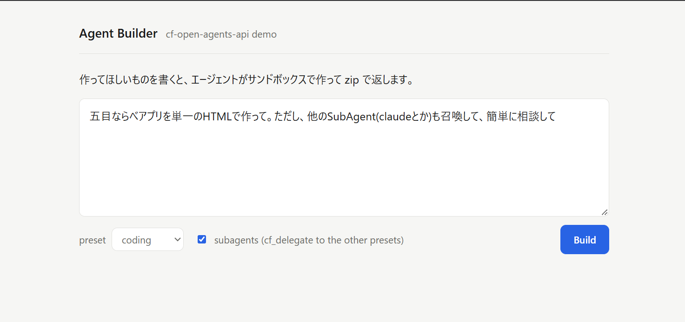

# QuickStart

This is the first document to read. It creates the demo app on your machine, explains what it does, and shows how to add the API to a Worker you already have. Everything runs locally except model inference, which goes to the provider you choose.

## Prerequisites

| Need               | Detail                                                                                                                                                                                                                                          |
| ------------------ | ----------------------------------------------------------------------------------------------------------------------------------------------------------------------------------------------------------------------------------------------- |
| Node               | 24 or newer                                                                                                                                                                                                                                     |
| pnpm               | Any current version (`corepack enable` gives you one); npm, yarn and bun also work with the CLI                                                                                                                                                 |
| Docker             | A running engine. Wrangler builds the harness and sandbox images on the first `wrangler dev` (roughly 5 GB, several minutes). With rootless Docker see [Rootless Docker](#rootless-docker)                                                      |
| Cloudflare account | Free for local development. Deployment needs the Workers Paid plan (Containers require it). Workers AI has no local emulator, so the `workers` preset needs `wrangler login` even locally and counts against your Workers AI usage              |
| Model credentials  | None with Workers AI. An OpenAI, Anthropic or OpenAI-compatible key otherwise; `init` writes the variable name into `.dev.vars` and the composition reads it from there. Keys never reach the runtimes or the sandbox, only the private gateway |

## Create the demo

```sh
mkdir my-agents && cd my-agents
pnpm dlx create-cf-open-agents-api@alpha init     # choose the demo template and a provider; Workers AI needs no key
pnpm install
pnpm exec wrangler login
pnpm dev                                            # or pnpm dev:rootless when init offered it
```

`init` asks for the template (`demo`, the default), the model provider, the runtimes to expose as presets, whether to add a Workers AI preset next to your provider and whether to enable programmatic tool calling. It then writes the project and prints what it created. `pnpm install` also restores the Docker build context under `.cf-open-agents-api/`.

Open <http://localhost:8787>. Type a prompt, for example `Build a tic-tac-toe game as a single HTML file`, pick a preset, optionally tick subagents (off by default), and press Build. The job page shows the transcript, the runtime's thinking, commands and subagents while the agent works, then the files it wrote and a zip download.




The screenshots were taken from a Japanese-language build of the same app; the generated app is in English.

What happens under the hood:

- The Hono app calls the Agents API in the same Worker through the `AGENTS` self Service Binding with the official `openai` client, whose `fetch` is `tenantFetch(env.AGENTS, "default")`: the app names the tenant itself and no API token crosses the binding.
- `sessions.create` with `environment: { type: "openai_hosted" }` creates a session and starts a Cloudflare sandbox container for its `/workspace`; the preset decides which native runtime (Codex, Claude Code or OpenCode) runs in the harness container and which gateway model it talks to.
- The turn runs the runtime's own agent loop. Model calls leave only through the private gateway, which holds the provider key; shell and file tools run in the sandbox. With subagents ticked, `multi_agent` is enabled and the preset may delegate to the presets in its `delegates`.
- The job page opens the session's live SSE, replays the durable event log (`GET /cf/v1/sessions/<id>/events?after=<seq>`) into the committed transcript, and streams the rest of the page as HTML while the turn runs. There is no client script and nothing polls.
- Reload at any point: the page rebuilds from the log and reattaches at its cursor. A dropped page loses nothing and never cancels the turn, which is the durable-log property on one screen. A page opened after the turn has settled takes the same path, replaying the log through the same fold as the live page, so both render the same transcript.
- When the turn completes, the runtime's state is checkpointed to R2 and every file under `/workspace/outputs` is published as an artifact. The job page offers a zip download while the artifacts total at most 32 MiB; past that cap it links each file for a streamed download instead.

## Add the API to an existing Worker

Run `init` in the directory that holds your `wrangler.jsonc` (a Vite + `@cloudflare/vite-plugin` app, a Hono Worker, anything Wrangler deploys):

```sh
pnpm dlx create-cf-open-agents-api@alpha init
pnpm install
pnpm exec wrangler login
pnpm dev
```

It adds the bindings to `wrangler.jsonc` without losing your comments (SQLite Durable Objects, two containers, two R2 buckets, the `MODEL_GATEWAY` and `AGENTS` self Service Bindings, `CODE_LOADER`, `ai`), writes the composition to `src/agents.ts`, appends one re-export line to your entry so Wrangler finds the classes, snapshots the Docker build context into `.cf-open-agents-api/`, creates `.dev.vars` with a random `API_TOKEN` and pins the dependencies. Your default export is untouched.

Your code reaches the API through the `AGENTS` binding. Hand it to the official client the way [Use it from your Worker](../README.md#use-it-from-your-worker) shows, with `tenantFetch` as the credential: the binding names the tenant, so no token crosses it. `openai_hosted` is the SDK's wire name and selects a Cloudflare sandbox here; derive the tenant from your own verified identity in a multi-tenant app, never from a request body. The typed RPC methods and a forwarded route for bearer-token callers are the other ways in; the [Service Binding guide](service-binding.md) covers those, plus streaming, function tools and cancellation.

## Where things live

| File             | Holds                                                                                                                                                                                                                                                                                                                                             |
| ---------------- | ------------------------------------------------------------------------------------------------------------------------------------------------------------------------------------------------------------------------------------------------------------------------------------------------------------------------------------------------- |
| `src/agents.ts`  | The composition: `agents` (the presets clients name in `agent.model`, each with a `harness`, a gateway `model`, optional `delegates`, `tiers` and `webSearch`), `models` (the private gateway registry: `nativeModel`, `aiSDKModel`, `openAICompatibleModel` entries built on first use) and `authenticate` (`bearerTenant` guards the HTTP path) |
| `.dev.vars`      | `API_TOKEN` (the bearer token for HTTP callers, 32+ characters), your provider key, `LOCAL_BACKUPS=true` (sandbox backups on the local R2 emulator; never set in production). Git-ignored; `.dev.vars.example` is the template                                                                                                                    |
| `wrangler.jsonc` | The bindings, the two container classes with their Dockerfiles, the R2 buckets, the pinned `compatibility_date` and `ai` with `remote: true`                                                                                                                                                                                                      |
| `src/index.tsx`  | Demo template only: the Hono app and its routes; `src/ui.tsx` holds the views                                                                                                                                                                                                                                                                     |

Change a model: add an entry to `models` and point a preset's `model` (or a `tiers` entry) at it. Change who may call the HTTP API: replace `authenticate`. A session pins its preset and gateway model at creation, so editing a preset affects new sessions only. See [Extending](extending.md).

## Questions

**How do I enable web search?** Use a preset with `webSearch: true` whose gateway entry is a `nativeModel` connection (the generated `codex` preset with OpenAI, or Claude Code with Anthropic); the portable AI SDK adapter cannot carry hosted search, and OpenCode has none. The client then adds a `web_search` tool to `agent.tools`. See [Images, web search and streamed progress](environments-and-tools.md#images-web-search-and-streamed-progress).

**Which model does a Claude Code subagent use?** The preset's `tiers`. When the parent spawns a native subagent with `model: "haiku"`, `"sonnet"` or `"opus"`, that tier resolves to the gateway entry named in `tiers`; a missing tier falls back to the preset's `model`. The generated composition maps `haiku` to the cheaper `fast` entry.

**Why does the status say `idle` after a failure?** A failed turn returns the session to `idle` with `session.error` set, so the next turn can continue from the last committed checkpoint. Read `session.error` and the turn's `error`, as the demo does. Only an indeterminate outcome (`outcome_unknown`, `programmatic_execution_uncertain`) leaves the session `failed`; fork it to continue.

**Rootless Docker?** The session and containers start but every turn fails with `internal_error` or `connection_failed`, because Wrangler's local container proxy assumes a rootful Docker bridge in workerd's network namespace. `init` detects a rootless engine and offers `pnpm dev:rootless`, which runs `wrangler dev` inside rootlesskit's namespace and bridges the port back; `init --rootless` adds it later. It is a temporary workaround, to be removed when Wrangler supports rootless engines. See [known issues](known-issues.md).

**A second `wrangler dev` broke the first one?** Two `wrangler dev` sessions on the same Docker engine with the same Dockerfile remove each other's image tags; run one at a time. See [known issues](known-issues.md).

## Deploy

**Before you deploy the demo.** The demo page has no login: with the default `workers_dev: true`, anyone who finds the workers.dev URL can create sessions and run agents on your account. Put [Cloudflare Access](https://developers.cloudflare.com/cloudflare-one/policies/access/) in front of the Worker or replace the page with your own auth first; `workers_dev: false` in `wrangler.jsonc` keeps it private to Service Bindings.

**Secrets first, then deploy.** Nothing in `.dev.vars` reaches production: `wrangler deploy` uploads the code and the bindings, and every secret has to be set on the Worker. Locally, `LOCAL_BACKUPS=true` keeps sandbox backups on Wrangler's R2 emulator, which needs no credentials. In production the Sandbox SDK writes each workspace backup to your R2 bucket through presigned URLs, and it signs those with an R2 API token, so a deployment without these secrets refuses every hosted session with `503 environment_unavailable` naming the ones that are missing.

| Secret                                     | Where it comes from                                                                                                                                                                                  |
| ------------------------------------------ | ---------------------------------------------------------------------------------------------------------------------------------------------------------------------------------------------------- |
| `R2_ACCESS_KEY_ID`, `R2_SECRET_ACCESS_KEY` | Cloudflare dashboard, R2 → Manage R2 API Tokens → Create API token, with Object Read & Write on the workspaces bucket (`<worker>-workspaces`). The dashboard shows the access key ID and secret once |
| `CLOUDFLARE_R2_ACCOUNT_ID`                 | Your account ID, as printed by `pnpm exec wrangler whoami`                                                                                                                                           |
| `API_TOKEN`                                | Any 32 or more random characters. Only HTTP callers need it; the demo page talks to the API over a Service Binding                                                                                   |
| Provider keys (`OPENAI_API_KEY`, ...)      | Whatever `models` in `src/agents.ts` reads. The `workers` preset uses the `AI` binding and needs none                                                                                                |

`setup` creates both R2 buckets and asks for every secret in one go; deploy afterwards:

```sh
pnpm dlx create-cf-open-agents-api@alpha setup
pnpm exec wrangler deploy
```

By hand, that is `pnpm exec wrangler r2 bucket create <worker>-checkpoints` and `<worker>-workspaces`, then `pnpm exec wrangler secret put <NAME>` for each secret. Secrets take effect on the next request without a redeploy. Never set `LOCAL_BACKUPS` in production. See [deployment](deployment.md) for the cost model and the rest of the walkthrough.

## Next

| Topic                                           | Guide                                                                        |
| ----------------------------------------------- | ---------------------------------------------------------------------------- |
| Another Worker, Service Binding, OpenAI client  | [Service Binding guide](service-binding.md)                                  |
| Another Worker, typed RPC without HTTP          | [RPC guide](rpc.md)                                                          |
| Node, Python or anything else over HTTPS        | [HTTP guide](http-api.md)                                                    |
| The setup CLI and the generated files           | [create-cf-open-agents-api](../packages/create-cf-open-agents-api/README.md) |
| Embedding the library in your own Worker        | [Library API](library-api.md)                                                |
| Files, skills, templates, MCP, subagents, forks | [Environments and tools](environments-and-tools.md)                          |
| Hosted web search, or a search of your own      | [Web search](web-search.md)                                                  |
| Presets, model adapters, custom drivers         | [Extending](extending.md)                                                    |
| What the official SDK can and cannot do here    | [Compatibility profile](compatibility.md)                                    |
